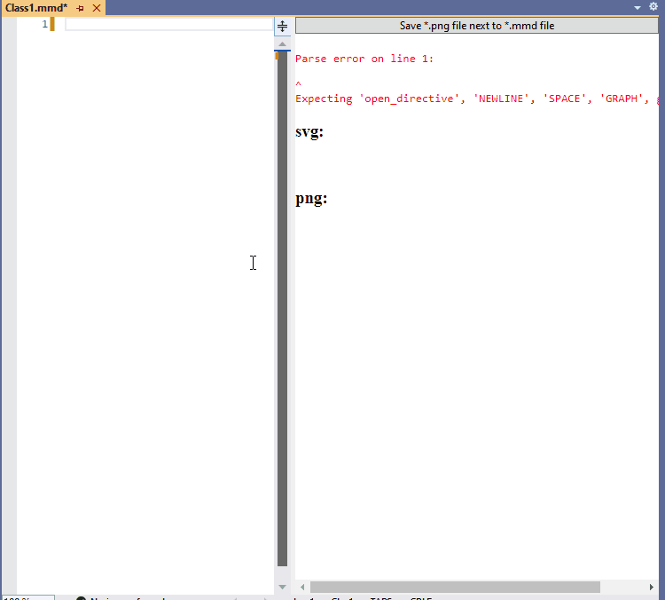

# Mermaid editor for VisualStudio

A very simple editor for Mermaid files(*.mmd) in Visual Studio. You can download it from [Visual Studio Marketplace](https://marketplace.visualstudio.com/items?itemName=NeVeS.MermaidEditorForVisualStudio). 
- live preview 
- generates diagrams in *.svg and *.png formats. 
- syntax highlighting
- displays parsing errors

> **Warning**
Preview requires [Microsoft Edge WebView2](https://developer.microsoft.com/en-us/microsoft-edge/webview2/) to be installed on the machine.

> **Note**
Syntax highlighting is possible thanks to [bpruitt-goddard/vscode-mermaid-syntax-highlight
](https://github.com/bpruitt-goddard/vscode-mermaid-syntax-highlight).

