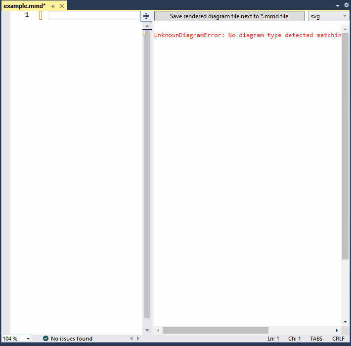

# MermaidEditorForVisualStudio
Very simple editor for Mermaid files(*.mmd). It only offers live preview and generates diagrams in *.svg and *.png formats.

Preview requires [Microsoft Edge WebView2](https://developer.microsoft.com/en-us/microsoft-edge/webview2/) to be installed on the machine.
